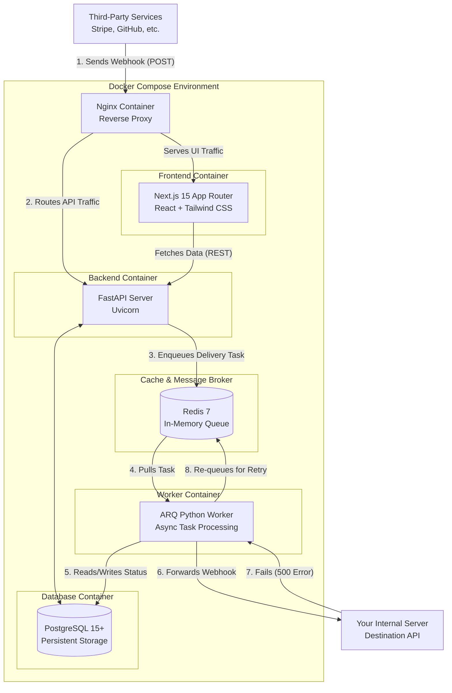

#  HookShield

**HookShield** is an enterprise-grade Webhook Proxy and Exponential Retry Engine. 

It acts as a secure, intermediate buffer between third-party services (like Stripe, GitHub, or Shopify) and your internal servers. If your server goes down, HookShield catches the webhook, securely stores the payload, and automatically retries the delivery using an exponential backoff strategy until your system recovers.

---

##  Core Features

*   ** Smart Webhook Proxy & HMAC Security:** Issue unique proxy URLs to third-party services. Secure them with Webhook Secrets to cryptographically verify HMAC SHA-256 signatures before forwarding payloads to your actual destination.
*   ** Asynchronous Task Queue (Redis + ARQ):** High-performance, non-blocking webhook processing and delivery. Webhooks are immediately acknowledged and instantly queued in Redis for lightning-fast background processing.
*   ** Automatic Retries & Incident Board:** If your destination server is unreachable (returns 500+ errors), HookShield automatically queues the payload. Failed deliveries populate a Kanban-style Incident Board where you can manually review and replay them.
*   ** Live Event Logs:** A real-time, virtualized table of all incoming webhooks, complete with HTTP headers, JSON payload inspection, latency tracking, and status codes.
*   ** Analytics & Queue Health Dashboard:** Monitor your system's health with total volume metrics, success/failure rates, average latency visualizations, and real-time Queue Depth monitoring to detect Redis congestion.
*   ** Secure Authentication:** Built-in JWT authentication with email/password logic, plus drop-in support for Google and GitHub OAuth.
*   ** CI/CD Pipeline:** Built-in automated GitHub Actions deployment pipeline for hands-free server updates.

---

##  System Architecture

HookShield is designed with a decoupled architecture for maximum scalability and reliability.



### Architecture Breakdown
1. **Docker Compose Environment:** The entire application runs within an isolated Docker network, ensuring services are decoupled but communicate securely.
2. **Nginx Reverse Proxy:** Acts as the public-facing gateway, routing external traffic to either the Next.js frontend or the FastAPI backend (`/api/*`).
3. **Next.js (App Router) Frontend:** A containerized, heavily stylized React application providing the dashboards, live logs, and incident management interfaces.
4. **FastAPI Backend (Uvicorn):** A highly concurrent Python server running via Uvicorn. It instantly accepts payloads, securely validates HMAC signatures, logs them, and hands them off to the queue.
5. **Redis & ARQ Worker:** Webhooks are enqueued into a Redis cluster. The dedicated ARQ Python Worker pulls jobs from Redis and handles the actual HTTP forwarding and exponential backoff retry logic to prevent blocking the main API.
6. **PostgreSQL Database:** The persistent storage layer running in its own container, safely storing user accounts, endpoints, and the historical event logs.

---

##  User Guide: How to Use HookShield

Follow these steps to seamlessly integrate HookShield into your webhook flow:

### 1. Create a Project & Endpoint
* Log in to the HookShield dashboard.
* Click on **"Create Project"** (e.g., "Payment Processing").
* Inside the project, click **"Add Endpoint"**. You will be asked for the **Destination URL** (the URL on *your* server that actually processes the webhook) and an optional **Webhook Secret**.
* HookShield will instantly generate a **Proxy URL** for you.

### 2. Configure Your Third-Party Provider
* Go to the third-party service (e.g., your Stripe Developer Dashboard).
* Paste the **HookShield Proxy URL** into their webhook configuration field. 
* *Result: Stripe will now send webhooks to HookShield, and HookShield will instantly forward them to your server.*

### 3. Monitor Traffic (Analytics & Live Logs)
* Navigate to the **Live Event Logs** tab. As third-party services trigger webhooks, you will see them appear here in real-time. 
* You can click on any log to inspect the exact JSON payload, headers, and response latency.
* The **Analytics** tab will generate visualizations showing traffic spikes, success ratios, and live Queue Health status.

### 4. Manage Failures (Incident Board)
* If your destination server crashes or returns an error, HookShield catches the failure.
* Navigate to the **Incident Board**. You will see Kanban-style cards for every failed webhook delivery.
* The Redis ARQ worker will automatically begin retrying the delivery in the background using an exponential backoff.
* You can manually click **"Replay"** on any card to force an immediate retry once you know your server is back online.

---

##  Technology Stack

*   **Frontend:** Next.js 15 (App Router), React, Tailwind CSS, Lucide Icons, Recharts (for analytics).
*   **Backend:** FastAPI (Python), SQLAlchemy (AsyncORM), Alembic (Migrations), Uvicorn.
*   **Message Broker & Tasks:** Redis 7, ARQ (Async Python Queue).
*   **Database:** PostgreSQL 15 (Production) / SQLite (Local Development).
*   **Infrastructure & CI/CD:** Docker, Docker Compose, Nginx, GitHub Actions.

---

##  Local Development (Quick Start)

To run the application on your personal computer for development and testing:

### 1. Backend Setup (FastAPI & Redis)
Ensure you have Redis running locally or via Docker. Open a terminal in the project root and run:
```bash
cd backend
python -m venv venv
venv\Scripts\activate      # On Windows
# source venv/bin/activate # On Mac/Linux
pip install -r requirements.txt

# Start the server
uvicorn app.main:app --reload --port 8000
```
*The API will be available at http://localhost:8000/docs*

To start the ARQ worker locally:
```bash
# In a new terminal window
cd backend
venv\Scripts\activate
arq app.worker.WorkerSettings
```

### 2. Frontend Setup (Next.js)
Open a **new** terminal in the project root and run:
```bash
cd frontend
npm install

# Start the dev server
npm run dev
```
*The UI will be available at http://localhost:3000*

---

##  Production Deployment

HookShield is fully containerized and ready for production deployment using Docker. 

A comprehensive, step-by-step PDF/Markdown guide on how to rent a server, link a domain name, configure OAuth keys, and deploy the application can be found in the root directory: 
 **[HookShield_Deployment_Guide.md](./HookShield_Deployment_Guide.md)**

### TL;DR Deploy Command:
```bash
cp .env.example .env.production
# Edit .env.production with your real API keys/Database credentials

# Build and start all services
docker-compose --env-file .env.production up -d --build
```

**Note:** The production frontend is exposed on `http://localhost:3001` via `docker-compose` to prevent conflicts with local Next.js dev servers running on port 3000.
